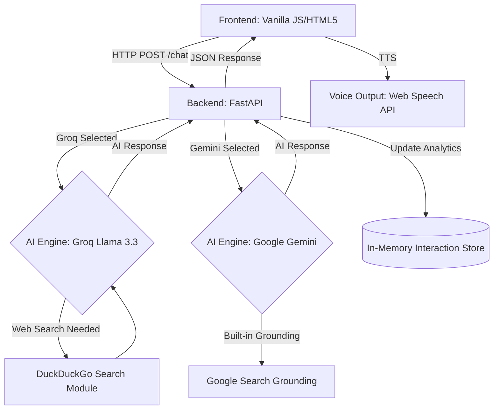

# 🤖 OmniServe AI – Professional Voice Customer Support Platform

[](https://github.com/rashedulalbab253/Customer_voice_agent/actions)
[](https://www.python.org/)
[](https://fastapi.tiangolo.com/)

**OmniServe AI** is a professional, context-aware **Voice Customer Support Platform** designed for real-time engagement. Built with **FastAPI**, **Google Gemini**, **Groq (Llama 3.3)**, and a sleek **Enterprise Modern UI**, this system provides human-like interaction with persistent context, real-time web search grounding, and analytics.

---

## 🏗️ Project Architecture

The system follows a modern decoupled architecture, ensuring scalability and ease of deployment:



---

## 🚀 Key Features

-   **🧠 Dual AI Providers**: Flexibly switch between **Google Gemini 2.0 Flash** and **Groq (Llama 3.3)** directly from the UI.
-   **🌍 Real-Time Web Search Grounding**: 
    - Gemini utilizes native **Google Search Grounding**.
    - Groq utilizes a custom-built **DuckDuckGo Web Search module** to fetch real-time data for product pricing, releases (like iPhone 17), and current events.
-   **🎙️ Voice-First Interaction**: Integrated Speech-to-Text for input and Text-to-Speech (TTS) for natural-sounding AI responses.
-   **🗣️ Bengali & English Support**: Fully multilingual capabilities for both voice input and audio output.
-   **💭 Persistent Smart Context**: Remembers conversation history continuously across messages without dropping context.
-   **📈 Real-time Analytics**: Built-in dashboard to track total interactions, unique users, empty queries, and average response times.
-   **☁️ Cloud-Ready Deployment**: Includes dynamic port bindings perfect for 1-click deployments on platforms like **Render**.

---

## 🛠️ Tech Stack

-   **Language**: Python 3.12+
-   **Web Framework**: FastAPI
-   **AI Inference**: Google API (`google-genai`), Groq API (`groq`)
-   **Web Search Engine**: DuckDuckGo Search (`duckduckgo-search`)
-   **Frontend**: HTML5, CSS3 (Vanilla), JavaScript (ES6+)
-   **Voice**: Web Speech API
-   **Containerization**: Docker & Docker Compose

---

## 📦 Installation & Setup

### 1. Prerequisites
- Python 3.12+
- Google Gemini API Key ([Get it here](https://aistudio.google.com/))
- Groq API Key ([Get it here](https://console.groq.com/)) 
- Docker Desktop (Optional)

### 2. Local Development
1.  **Clone the Repository**:
    ```bash
    git clone https://github.com/rashedulalbab253/Customer_voice_agent.git
    cd Customer_voice_agent
    ```
2.  **Configuration**:
    Create a `.env` file in the root directory:
    ```env
    DEFAULT_PROVIDER=groq
    GOOGLE_API_KEY=your_gemini_key_here
    GROQ_API_KEY=your_groq_key_here
    ```
3.  **Environment Setup**:
    ```bash
    python -m venv env
    .\env\Scripts\activate
    pip install -r requirements.txt
    ```
4.  **Run the Application**:
    ```bash
    python run.py
    ```
    Visit: `http://localhost:8000`

### 3. Deploying to Render
This application is pre-configured for Render.
1. Connect your GitHub repository to Render.
2. Choose **Web Service** -> **Docker**.
3. Render will automatically detect the `Dockerfile` and dynamically bind the port.

### 4. Running with Docker Locally
```bash
docker-compose up --build
```

---

## 👨‍💻 Author

**Rashedul Albab**
-   **Position**: Lead Developer
-   **Focus**: Full-Stack AI Engineering & Multimodal Conversational Systems
-   **GitHub**: [@rashedulalbab253](https://github.com/rashedulalbab253)

---

*© 2026 OmniServe AI. Developed with ❤️ by Rashedul Albab.*
